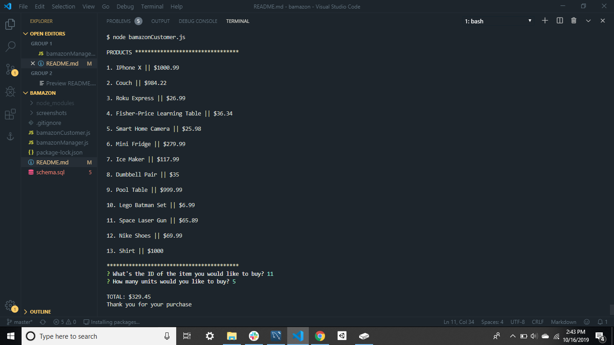
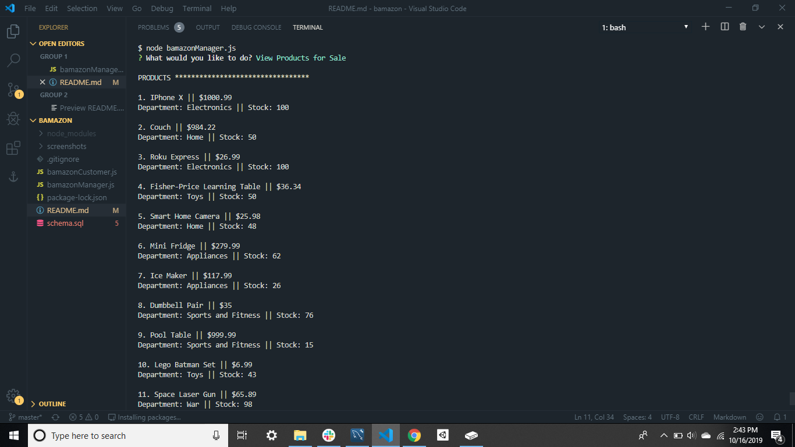
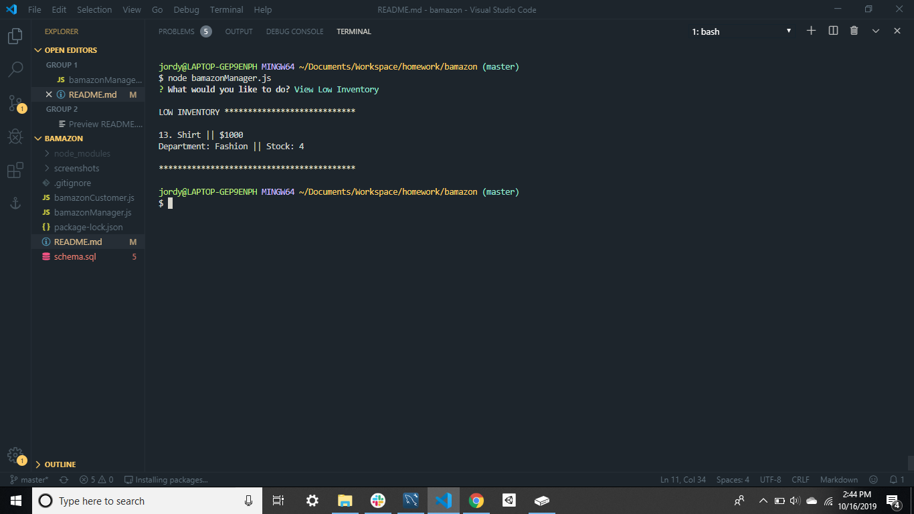
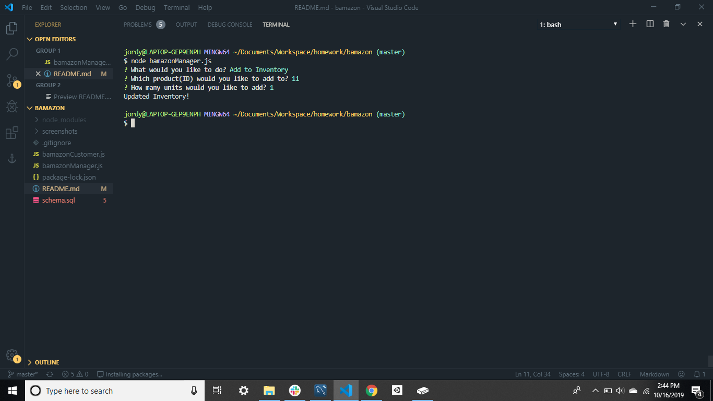
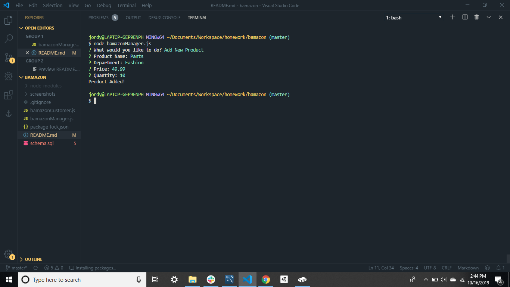

# BAMAZON
## Overview
This is a mock Amazon CLI app. As a customer you can purchase items. And as a manager you can update the inventory, add new products, view products, and view what's low in stock.

## Purpose
The purpose of this app is to demonstrate skills in Node and in MySQL

## Screenshots
Here is the app in action!

